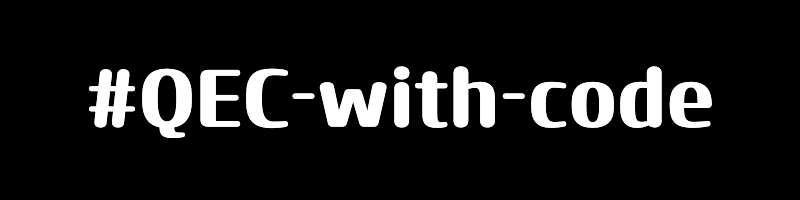

[](https://opensource.org/licenses/Apache-2.0)

This repository provides a collection of **Quantum Error Correction (QEC)** code implementations. The goal is to demonstrate how QEC works with different error thresholds and provide practical examples of implementing error correction codes on quantum circuits.

## List of Implemented QEC Codes

- **[Repetition code](notebooks/repetition_code.ipynb)**
- **[Rotated surface code](notebooks/rotated_surface_code.ipynb)**

## Installation

This package can be installed by cloning the repository and running

```console
pip install .
```

in the root directory of this repostory.

## Basic Usage

### Visualizing the graph

```py
from qec import RotatedSurfaceCode

# Initializaze the graph
rot = RotatedSurfaceCode(distance = 5)

rot.draw_graph()
```

### Accessing Stim circuit

```py
from qec import RepetitionCode

# Initializaze the graph
rep = RepetitionCode(
    distance = 5,
    depolarize1_rate = 0.05,
    depolarize2_rate = 0.05
)

# At this stage the Stim circuit is built
rep.build_memory_circuit(number_of_rounds=2)
rep.memory_circuit.diagram()
```

### Running a threshold computation

```py
# Initialize the Threshold LAB instance
th = ThresholdLAB(
    distances= [3, 5, 7, 11],
    code=RepetitionCode,
    error_rates= np.linspace(0, 0.1, 10)
)

# Sampling and estimating logical error rates via Monte Carlo
th.collect_stats(num_shots=10**4)

# Plotting the collected statistics
th.plot_stats(
    x_min = 3e-2,
    x_max = 1e-1,
    y_min = 1e-3,
    y_max = 5e-1
)
```

## Contributing

Pull requests and issues are more than welcomed. We welcome contributions from anyone. Please visit **[CONTRIBUTING.md](CONTRIBUTING.md)** for details.

## License

**[Apache License 2.0](LICENSE)**
